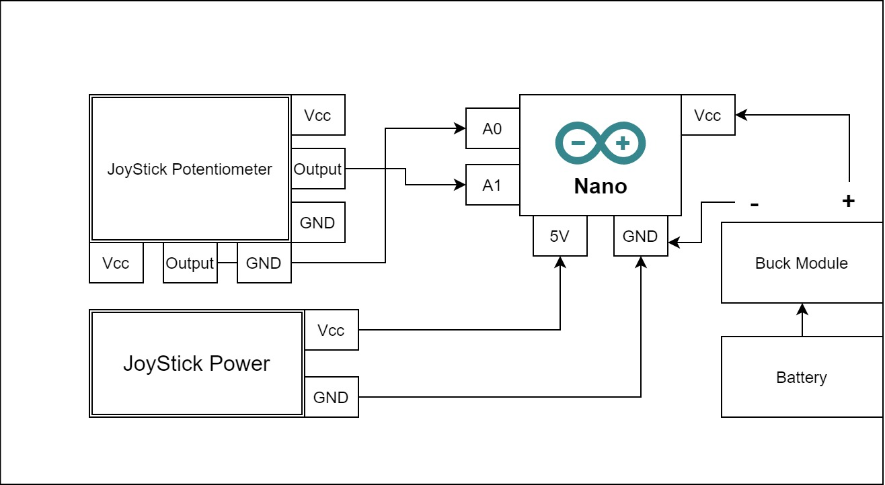

# Drone Controller Using nRF24L01 and Gamepad

This is a controller that can control drones or rc cars wirelessly. I have used nRF24L01 for transmitter and receiver and Gamepad for Potentiometer value.

## 💻 Tech Spec

## 🛠 Components Used

- Arduino Uno x 1
- Arduino Nano x 1
- Gamepad x 1
- Veroboard x 1
- Buck Module x 1
- nRF24L01 x 2
- Ethernet wire 
- Female Pin Header Single Row

## 🚀 How to Start

Upload the **nrf24_receiver.ino** to the Arduino Uno connected to the Laptop and **nrf24_transmitter.ino** to the Arduino Nano soldered in the veroboard.

## 🖍📐 Schematics

### Full Working Diagram

## Connection Diagram of Arduino Nano with nrf24l01

## Connection Diagram of Potentiometer

## Project Picture

## You can See Demo Video here :

## 🏆 Contributors 

|      Name 🎖️    |     Social Media 👋    | GitHub     :octocat: |
|:-------------:|:-------------------|------------------|
| Mirza Nihal Baig |  :mortar_board: [LinkedIn](https://www.linkedin.com/in/mirza-nihal-baig-0361971a0/) | [@nihalbaig0](https://github.com/nihalbaig0)  |

